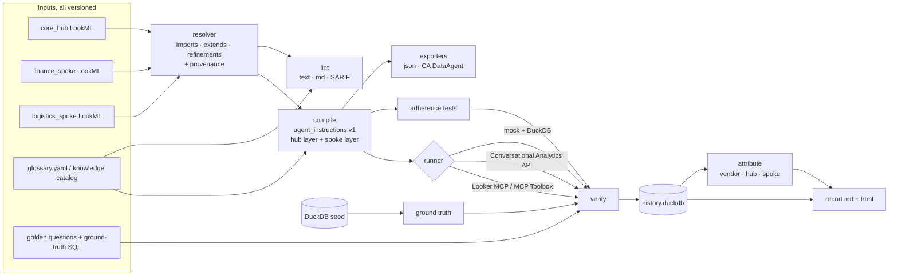

# lookml-agentops

**Treat Looker AI-agent instructions and answer correctness as code.**

`lkagent` lints your LookML and business glossary. It compiles them into layered agent
instructions, and verifies the agent's answers against independently computed ground truth. When
an answer changes, it tells you **who changed it**:

- **vendor**: Google changed Conversational Analytics or MCP behaviour;
- **hub**: the central base model changed, and every spoke inherited the change;
- **spoke**: a business unit changed its own extension.

It targets teams running Looker with AI agents: native Conversational Analytics, the Looker
managed MCP server, or MCP Toolbox plus an LLM. It fits hub-and-spoke LookML, where a central team
owns a base model that business units import and extend.

Everything runs offline against a synthetic warehouse (DuckDB) and a deterministic mock agent.
Real runners are optional adapters.

> All data is synthetic. The demo company, **Harborline Supply Co.**, is fictional. PII-shaped
> columns are generated with a fixed Faker seed on reserved `example.*` domains.

---

## The demo: an answer changed, and you find out why

```bash
git clone <this repo> && cd lookml-agentops
uv sync
uv run lkagent demo            # or: scripts/demo_drift.sh
```

About 15 seconds later:

```
step 1  baseline
  run-0001  baseline (vendor v1)                       128/128 pass
step 2  the vendor changes filter-value matching
  run-0002  vendor switched to fuzzy value matching    123/128 pass
run-0001 -> run-0002: 5 changed test(s) (5 vendor)
vendor: 5 change(s), all trap:dirty-categorical -> likely a filter-value resolution change (e.g. fuzzy matching of categorical values)
  VENDOR  logistics_spoke/log-002: pass -> fail
  ...
step 3  the hub team edits net revenue (drops refunds)
  run-0003  hub: net revenue ignores refunds           114/128 pass
run-0001 -> run-0003: 14 changed test(s) (14 hub)
hub: 14 change(s) across finance_spoke, logistics_spoke
step 4  the finance team redefines its refund rate
  run-0004  finance spoke: refund rate over net revenue 127/128 pass
run-0001 -> run-0004: 1 changed test(s) (1 spoke)
demo OK: vendor, hub and spoke changes were attributed correctly
```

Each step writes a Markdown report (sized for a PR comment) and a self-contained HTML report to
`lkagent-demo/reports/{vendor,hub,spoke}/`. The HTML works offline with no external assets.

## Five-minute quickstart

```bash
uv sync                                             # Python 3.11+
cd examples/harborline

uv run lkagent seed                                 # ~5s: CSVs + DuckDB, prints a stable content hash
uv run lkagent graph --spoke finance_spoke          # import graph + effective model with provenance
uv run lkagent lint                                 # 19 rules; -f markdown | sarif
uv run lkagent compile                              # build/<spoke>/{agent_instructions,ca_agent}.json + tests
uv run lkagent verify                               # golden + adherence tests through the MockRunner
uv run lkagent verify --profile v3_instruction_override   # simulate a vendor change
uv run lkagent attribute                            # vendor / hub / spoke / unknown per changed test
uv run lkagent report                               # reports/report.md + reports/report.html
```

## What each command does

| Command | What it does |
|---|---|
| `lkagent seed` | Generates about two fiscal years of deterministic data with documented traps: revenue ambiguity, a Feb-1 fiscal year, dirty categoricals, test accounts, soft deletes, time zones, late refunds, void invoices, and PII. See [`TRAPS.md`](examples/harborline/seed/TRAPS.md). |
| `lkagent graph` | Resolves imports, includes, `extends`, and refinements (`+view` / `+explore`) into each spoke's **effective model**. Every field records where it was defined or last refined (project, file, line). |
| `lkagent lint` | Checks completeness and governance: descriptions, glossary links, untagged or unprotected PII, redefined certified metrics, missing test-account guards, fiscal joins, AI surface area. Outputs text, Markdown, or SARIF. See [rules](docs/lint-rules.md). |
| `lkagent compile` | Deterministically templates the metadata into the neutral [`agent_instructions.v1`](docs/agent-instructions-v1.md) schema, as a hub layer plus a spoke layer. It generates one adherence test per rule and exports a Conversational Analytics `DataAgent` body. A spoke contradicting a hub certified rule is a compile error. |
| `lkagent verify` | Runs golden and adherence tests through a runner (`mock`, `ca`, `mcp`). It compares **structure** (explore, fields, filters, resolved values, SQL guards) and **results** (within tolerance) against ground truth computed from the raw seed tables, never from Looker. Statuses: pass / fail / **degraded** (right result, wrong structure) / error / skipped. Every run is recorded. |
| `lkagent attribute` | Compares two runs. For each changed test, it checks which recorded inputs changed: hub or spoke tree hashes, instruction layer hashes, seed, and golden tests. It then groups vendor-attributed changes by trap tag. |
| `lkagent report` | Markdown and self-contained HTML: pass rates, degraded tests, attribution, per-rule adherence, and a trend. It never includes row-level data. |
| `lkagent demo` | The story above, on a scratch copy. |

## Architecture



More detail: [docs/architecture.md](docs/architecture.md).

## Repository layout

```
src/lookml_agentops/   seed · lookml · catalog · lint · compile · verify · attribute · report
examples/harborline/   lkagent.yaml, LookML (core_hub, finance_spoke, logistics_spoke),
                       catalog/glossary.yaml, golden/*.yaml + sql/, committed build/
tests/                 unit + integration; fixtures/broken_hub triggers every lint rule
docs/                  architecture, schema, lint rules, API verification log, own-Looker guide
```

In real deployments, each Looker project is usually **its own git repo**. The monorepo layout here
is for the demo. `lkagent.yaml` points each project at any checkout path, and
`verify --hub-pr <branch>` / `--spoke-pr <spoke> <branch>` check out a branch in a git worktree
while pinning the other projects.

## Determinism

Given the same inputs, the seed CSVs, compiled instructions, generated tests, and build manifest
are byte-identical. Tests enforce this, and `lkagent compile --check` enforces it in CI. Run
metadata such as timestamps lives only in `.lkagent/`.

## Running against your own Looker

See [docs/own-looker.md](docs/own-looker.md). In short:
1. Point `lkagent.yaml` at your hub and spoke checkouts and your glossary.
2. Run lint and compile.
3. Write golden questions whose ground truth comes from warehouse SQL.
4. Run `verify --runner ca` (or `mcp`) with credentials in environment variables.

Vendor API fields we couldn't confirm in the docs are marked `TODO(verify-api)` in the code and
listed in [docs/api-verification.md](docs/api-verification.md).

## CI

- `.github/workflows/pr.yml`: lint → SARIF upload → `compile --check` → verify (mock) → PR comment.
- `.github/workflows/nightly.yml`: scheduled verify, attribute, and report. It uses the CA runner
  when Google credentials are configured and falls back to the mock otherwise.
- `.github/workflows/ci.yml`: ruff, `mypy --strict`, and pytest on 3.11–3.13, plus the offline demo.

## Development

```bash
uv sync --all-extras && uv run pre-commit install
uv run ruff check . && uv run mypy && uv run pytest
```

See [CONTRIBUTING.md](CONTRIBUTING.md) and [SECURITY.md](SECURITY.md). Licensed under
[Apache-2.0](LICENSE).
