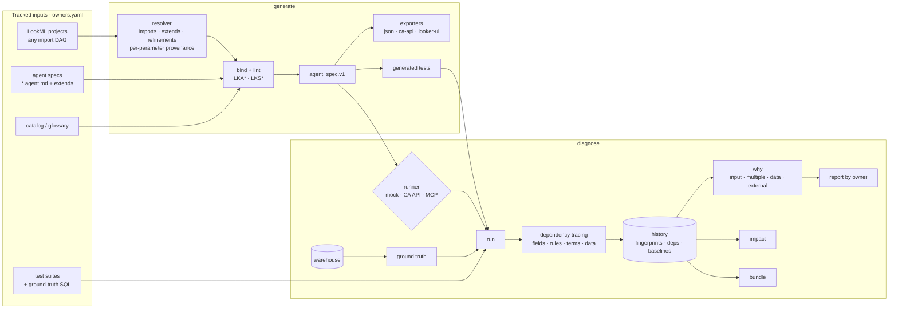

# lookml-agentops

**Author Looker AI agents as code, and find out why an agent's answer changed.**

`lkagent` has two modes:

- **`lkagent generate`**: any team (central IT, a business unit, an analyst) writes an agent spec
  in Markdown (`*.agent.md`). lkagent validates it against the resolved LookML model, compiles it
  to JSON for Looker **Conversational Analytics (CA)**, and generates a test for every rule.
- **`lkagent diagnose`**: *"The AI agent's answer changed. Why, and whose problem is it?"* Every
  run fingerprints everything that can change an answer: LookML projects, agent specs, the
  glossary, test suites, the runner, and the data. When an answer changes, lkagent points to the
  exact field, rule, or input that changed, and to the team that owns it.

It works for **any LookML topology**: one project, many independent projects, or projects that
import others. Hub-and-spoke is just one example, where a central project is imported by
business-unit projects. The demo uses four projects: `finance_project` and `logistics_project`
import `core_project`, and `procurement_project` stands alone.

Everything runs offline against a synthetic warehouse (DuckDB) and a deterministic mock agent.
Real CA and MCP runners are optional adapters.

> All data is synthetic. The demo company, **Harborline Supply Co.**, is fictional. PII-shaped
> columns come from a fixed Faker seed on reserved `example.*` domains.

---

## The demo: four answer changes, four owners

```bash
git clone <this repo> && cd lookml-agentops
uv sync
uv run lkagent demo            # or scripts/demo_drift.sh (about 20 seconds, no network)
```

```
step 0  baseline
  run-0001  baseline                                       82/82 pass
step 1  external: the vendor starts fuzzy-matching filter values
    external: 5 failure(s), all trap:dirty-categorical -> likely a filter-value resolution change
    evidence bundle: lkagent-demo/bundles/run-0001-run-0002.zip
step 2  LookML: core_project changes net_revenue's SQL (drops refunds)
    impact predicts 14 affected test(s) in finance-analyst, logistics-ops
    central-data-platform: 14 test(s) in finance-analyst, logistics-ops <- field:.../orders.net_revenue
      sql modified at core_project/views/orders.view.lkml:87
step 3  spec: finance-analyst edits a non-locked rule ('sales' -> gross revenue)
    finance-analytics: 1 test(s) in finance-analyst <- rule:sales-means-net value modified at
      agents/finance-analyst.agent.md:21
    compile error: ... LKS008 rule 'finance-revenue' contradicts locked rule 'revenue-default'
step 4  data: late-arriving refunds land in the warehouse
    data: 12 test(s) whose ground truth moved (drift, not a regression; accept with --rebaseline)
demo OK: external, LookML, spec and data changes were attributed to the right owners
```

| Scenario | Verdict | Owner (from `owners.yaml`) |
|---|---|---|
| The vendor fuzzy-matches filter values | **external**, grouped under `trap:dirty-categorical`, with an evidence zip for a support case | `bi-platform` |
| `core_project` changes `orders.net_revenue` SQL | **input** `lookml:core_project`: field, parameter and `file:line`, in *both* importing agents. `diagnose impact` predicted exactly these 14 tests beforehand. | `central-data-platform` |
| finance edits its own rule | **input** `agent:finance-analyst`, naming rule `sales-means-net`. Contradicting a *locked* baseline rule is a compile error instead. | `finance-analytics` |
| Late-arriving refunds | **data**: the expected answer moved (drift), not the agent | `data-engineering` |

Each step writes a Markdown report (sized for a PR comment) and a self-contained HTML report to
`lkagent-demo/reports/<scenario>/`. The HTML report has verdicts grouped by owner and cause, spec
adherence, and a trend. It never includes row-level data.

## Five-minute offline quickstart

```bash
uv sync                                          # Python 3.11+
cd examples/harborline

uv run lkagent seed                              # ~5s: deterministic CSVs + DuckDB
uv run lkagent graph --project finance_project   # import DAG + effective model with provenance

uv run lkagent generate lint                     # LookML + glossary + agent specs (text | markdown | sarif)
uv run lkagent generate compile                  # build/<agent>/{agent_spec.json, ca_context.json, looker_ui.md,
                                                 #   tests.generated.yaml}
uv run lkagent generate new ops-quick -d "Finance agent. Revenue means net revenue." \
    --explore finance_project::finance_orders   # draft a spec (offline stub provider), then lint it

uv run lkagent diagnose run                      # suites + generated tests through the mock agent
uv run lkagent diagnose run --scenario fuzzy_values
uv run lkagent diagnose why                      # attribute each changed test, with owner
uv run lkagent diagnose report                   # reports/report.md + reports/report.html
uv run lkagent diagnose run --explain-deps fin-003   # everything one test depends on, with file:line
```

## An agent spec

```markdown
---
agent: finance-analyst
description: Answers FP&A questions on revenue, invoices, refunds and collections.
extends: [shared/company-baseline.agent.md]     # any spec can extend any others
explores:
  - finance_project::finance_orders
  - finance_project::finance_invoices
derive: {lookml_descriptions: true, catalog_glossary: true}   # optional extra context
---

## Role
You are a finance analyst supporting FP&A. Be concise and always state the fiscal period used.

## Rules
- id: sales-means-net
  text: '"Sales" and "net sales" mean net revenue.'

## Vocabulary
- "collection days" → finance_invoices.days_sales_outstanding

## Guardrails
- Never return customer email, phone, date of birth, billing address or contact name.

## Golden queries
- id: gq-net-rev-region
  questions: [What was net revenue by region in FY2026-Q3?]
  looker_query: {model: finance, explore: finance_orders, fields: [regions.region_name, orders.net_revenue]}
```

Rule IDs are stable, and they drive test generation and attribution. A `locked: true` rule
(for example, the company-wide revenue definition in the baseline spec) can't be overridden or
contradicted by a spec that extends it. Full reference: [docs/agent-spec.md](docs/agent-spec.md).

## Commands

| Command | What it does |
|---|---|
| `lkagent seed [--delta late-refunds]` | Deterministic Harborline data with documented [traps](examples/harborline/seed/TRAPS.md) |
| `lkagent graph` | Import DAG (any topology; cycles are errors) and effective models with per-field provenance |
| `lkagent generate new` | Draft a `*.agent.md` from plain English, grounded in the model. The provider is pluggable, and the offline `stub` provider is the default. The draft is linted immediately. |
| `lkagent generate lint` | 19 LookML rules (LKA*) and 12 spec rules (LKS*): >5 explores, pivots, unknown fields, missing PII guardrails, locked-rule violations, placement advice. See [rules](docs/lint-rules.md). |
| `lkagent generate compile` | `*.agent.md` → `agent_spec.v1` → JSON, CA API authored context, Looker UI text, and generated tests. Deterministic; `--check` for CI. |
| `lkagent generate resolve-golden` | Explore URLs → Looker query objects (`GET /queries/slug/{slug}`), cached in `build/` |
| `lkagent diagnose run` | Run suites and generated tests through `mock` / `ca` / `mcp`. Each run records fingerprints, dependencies, and baselines. |
| `lkagent diagnose why [A] [B]` | Attribute each changed test (`input` / `multiple` / `data` / `external`) with owner, diff and confidence. See [diagnose.md](docs/diagnose.md). |
| `lkagent diagnose impact --base REF` | Predict affected agents and tests from a change in any project, spec, catalog or suite. `--run` runs only those tests. |
| `lkagent diagnose bundle A B` | Evidence zip for a vendor support case: structure and fingerprints only |
| `lkagent diagnose report` | Markdown and self-contained HTML, grouped by owner and cause |
| `lkagent demo` | The four-scenario story above |

## Architecture



More detail: [docs/architecture.md](docs/architecture.md).

## Repository layout

```
src/lookml_agentops/
  inputs/     tracked inputs, owners.yaml         lookml/    parser, resolver, provenance, sqlgen
  spec/       *.agent.md parser, agent_spec.v1   generate/  bind, lint rules, exporters, testgen, draft
  diagnose/   run, runners, deps, why, impact    report/    Markdown + HTML
  catalog/ lint/ seed/
examples/harborline/
  projects/{core,finance,logistics,procurement}_project/   four LookML projects
  agents/shared/company-baseline.agent.md, agents/*.agent.md
  catalog/glossary.yaml  suites/*.yaml + sql/  owners.yaml  lkagent.yaml  build/ (committed)
```

In real deployments each LookML project is usually its own git repo. Point
`projects.<name>.path` at separate checkouts; `diagnose impact --base-config` compares any two
checkouts.

## Determinism and privacy

- Seeds, compiled specs, generated tests, the build manifest and evidence bundles are
  byte-identical for identical inputs. Tests enforce this, and `generate compile --check` enforces
  it in CI.
- Credentials are read only from environment variables.
- History, reports and bundles hold answer structure and fingerprints. They never hold rows.

## Running against your own Looker

See [docs/own-looker.md](docs/own-looker.md). Anything about the CA API or Looker API that the
docs don't confirm is marked `TODO(verify-api)` and listed in
[docs/api-verification.md](docs/api-verification.md).

## CI

- `pr.yml`: `generate lint` (SARIF) → `generate compile --check` → `diagnose impact` → `diagnose run` → PR comment
- `nightly.yml`: `diagnose run` (CA when configured, otherwise mock) → `why` → report
- `ci.yml`: ruff, `mypy --strict`, pytest on Python 3.11–3.13, and the offline demo

Licensed under [Apache-2.0](LICENSE). See [CONTRIBUTING.md](CONTRIBUTING.md) and
[SECURITY.md](SECURITY.md).
