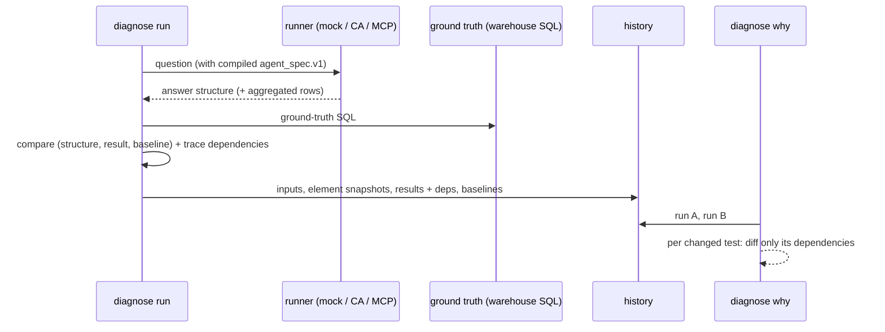

# Architecture

## Concepts

| Concept | Meaning |
|---|---|
| **Tracked input** | Anything that can change an answer. `input_id` is `<kind>:<name>`: `lookml:finance_project`, `agent:finance-analyst`, `catalog:glossary`, `suite:finance`, `runner:mock`, `data:warehouse`, `config:lkagent`. Versions are the last git commit touching the input's path (with a `+dirty` hash when modified), otherwise a content hash. For the runner, the version is its reported version plus the run date. For data, it's a hash of the ground-truth results. |
| **Owner** | Resolved from `owners.yaml` by input id and path glob. The most specific rule wins; otherwise the owner is `unassigned`. |
| **Element** | A fine-grained thing a test can depend on: a LookML field or explore (per effective model), a spec rule, vocabulary entry, guardrail or golden query, a catalog term, a test definition, the runner, or one ground-truth result. |
| **Facet** | The part of an element that matters. For fields: `semantic` (sql, type, filters, …) and `surface` (label, description, tags, hidden, …). For explores: `semantic` (guards, always_filter, joins) and `surface`. Everything else has one `content` facet. Each parameter records the file:line that last set it. |
| **Dependency** | A test's link to an element's facets, with a role and a closeness rank. |

## Topology-neutral resolution

The resolver builds each project's *effective model* from manifest imports (`local_dependency` /
`remote_dependency`), include globs, refinements (in include order), and `extends`. It works for
any import DAG. A cycle between projects is an error that names the cycle. Every field and
explore parameter keeps the location that last set it. So if `core_project` changes
`orders.net_revenue`'s SQL while `finance_project` refined only its description, the SQL change
is attributed to `core_project`.

## generate

```
*.agent.md ─parse→ ParsedSpec ─extends/locked→ AgentSpec (unbound)
          ─bind(model, catalog)→ AgentSpec (bound) + findings (LKS*)
          ─exporters→ agent_spec.json · ca_context.json · looker_ui.md
          ─testgen→ tests.generated.yaml
```

Binding resolves explores, vocabulary targets, rule claims (`"X" means Y` → field), explicit
field references, golden-query fields, guardrail PII coverage, and the optional derived context.
It never lets derived context override authored rules.

## diagnose



See [diagnose.md](diagnose.md) for the attribution algorithm.

## Modules

| Module | Responsibility |
|---|---|
| `inputs` | Tracked-input model, `owners.yaml`, declared inputs from `lkagent.yaml` |
| `lookml` | Parser with line numbers, resolver with per-parameter provenance, graph, SQL generator (mock) |
| `spec` | `*.agent.md` parser/renderer, `agent_spec.v1`, claims, extends/locked resolution, discovery |
| `generate` | Binding, spec lint findings, exporters, test generation, golden URL resolution, LLM drafting |
| `lint` | LookML rules (LKA*) and spec rules (LKS*), with text/Markdown/SARIF output |
| `diagnose` | Runners, comparator, ground truth, elements, dependencies, history, why, impact, bundle |
| `report` | Markdown and single-file HTML (inline SVG trend) |
