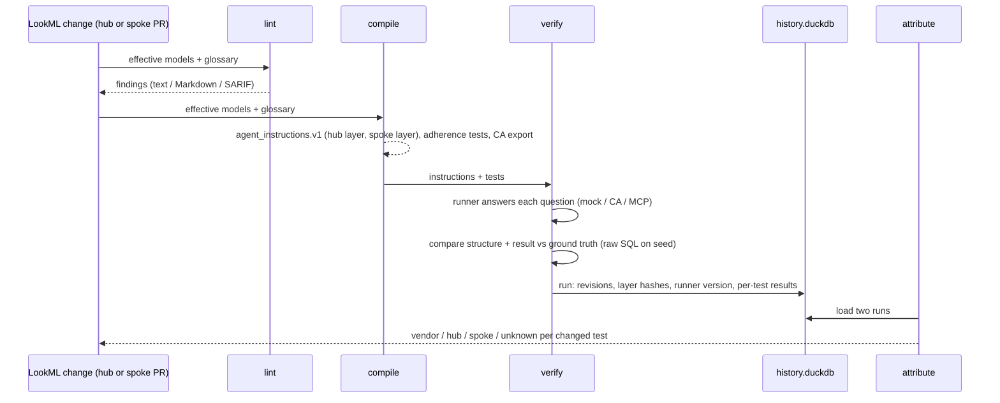

# Architecture

## Data flow

## Modules

| Module | Responsibility |
|---|---|
| `seed` | Deterministic synthetic data (per-table RNG streams, integer cents, canonical CSV), DuckDB and BigQuery loaders |
| `lookml.parse` | Walks the `lkml` syntax tree so every object keeps its line number, and reads `# lkagent:disable` exemptions |
| `lookml.resolve` | Manifest imports, include globs, refinements (include order; additive `join`/`link`/`filters`), extends, per-field provenance chains |
| `lookml.sqlgen` | Small LookML-subset → DuckDB SQL compiler used by the MockRunner. It refuses fan-out joins. |
| `catalog` | `CatalogAdapter` interface. `YamlCatalogAdapter` is implemented; the Dataplex adapter is a stub. |
| `lint` | Rule registry (LKA000–LKA018), config overrides, exemptions, text/Markdown/SARIF reporters |
| `compile` | Neutral schema, templated rules with provenance, layering and contradiction checks, test generation, exporters, polish guard |
| `verify` | Test models, runners, ground truth, comparator, history, PR modes (git worktrees) |
| `attribute` | Per-test classification by elimination over recorded inputs, plus tag grouping |
| `report` | Jinja2 templates: Markdown for PR comments, and single-file HTML with an inline SVG trend |

## Attribution model

Each run records:
- a **tree hash** (content hash) for every project, plus its commit SHA when available;
- the **instruction layer hashes** per spoke;
- the seed data hash;
- a hash of each golden test and its ground-truth SQL;
- the runner and version.

For a test whose status changed between two runs:

| Changed inputs | Cause |
|---|---|
| none | **vendor** (the only variable left is the agent's behaviour) |
| only the hub tree or hub layer | **hub** |
| only this spoke's tree or spoke layer | **spoke** |
| anything else (hub and spoke, seed data, golden test, as_of) | **unknown**, with the list |

Tree hashes are used instead of commit SHAs because, in a monorepo, a commit SHA changes for
every change anywhere. Compare runs that used the same runner when you want to isolate LookML
changes. Compare runs with the same inputs to isolate vendor changes.

## Why a neutral instruction schema

Vendor formats evolve. The compiler emits `agent_instructions.v1`. Exporters, such as the CA
`DataAgent` body, are thin mappings that use only documented fields. Everything else stays behind
`TODO(verify-api)`. See [api-verification.md](api-verification.md).
